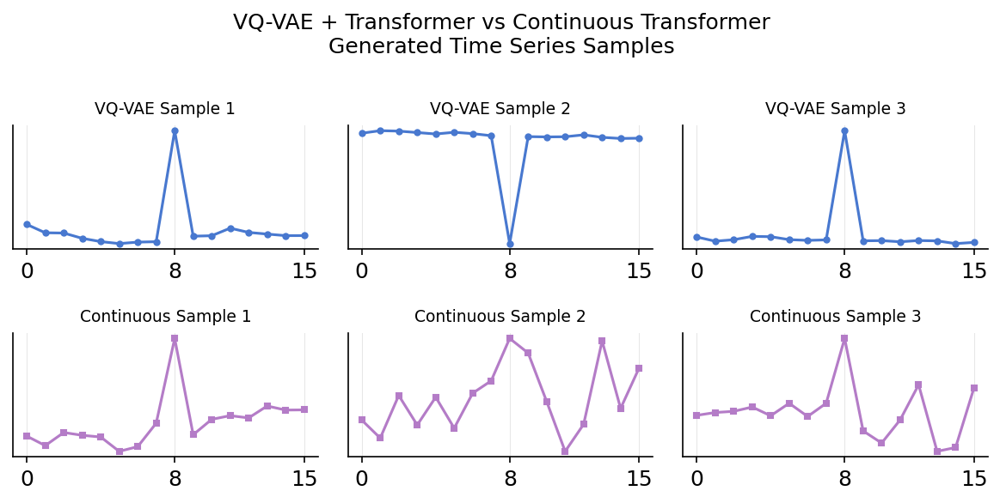

# Time Series Generation: Discrete vs Continuous Transformers



We compare two modern generative approaches for time series:
- **Discrete**: VQ-VAE + Transformer (tokenized)
- **Continuous**: JiT-style autoregressive Transformer (raw values)

## Key Finding

> **Continuous modeling better captures regime structure and generates more diverse samples** — despite being simpler (no tokenizer needed).

## Quantitative Results

| Metric | VQ-VAE + Transformer | Continuous Transformer |
|--------|----------------------|------------------------|
| Regime Distribution Match | 0.848 | **0.945** |
| Diversity | 3.916 | **5.901** |
| FID (lower = better) | 3.021 | **1.863** |

## Try It Yourself

```bash
# Train VQ-VAE + Transformer
python run_pipeline.py

# Train Continuous Transformer
python run_continuous_pipeline.py

# Compare results
python compare_models.py
